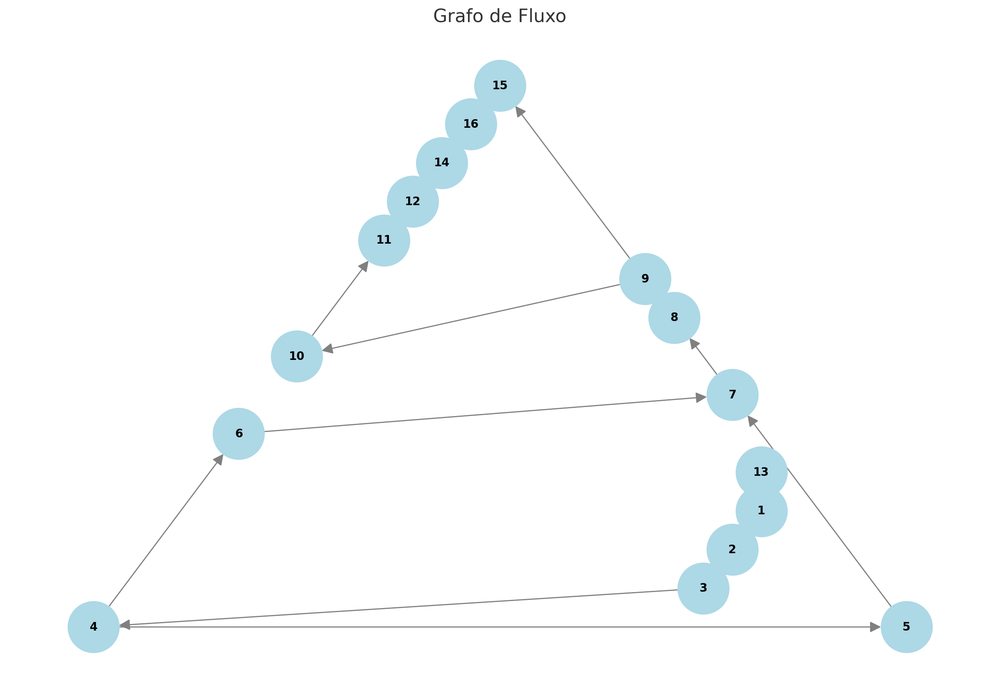

# Etapa 3 - Análise de Complexidade Ciclomática

Este documento apresenta o grafo de fluxo, o cálculo da complexidade ciclomática e os caminhos possíveis traçados.

---

## 1. Complexidade Ciclomática

A complexidade ciclomática é calculada com base na fórmula:  
**M = E − N + 2P**

- **E**: Número de arestas = 18  
- **N**: Número de nós = 16  
- **P**: Número de componentes conectados (1 neste caso)

**Cálculo:**  
M = 18 - 16 + 2(1)  
M = 4

**Conclusão:**  
A complexidade ciclomática é 4, o que indica que há **4 caminhos possíveis** no grafo.

---

## 2. Quantidade de Caminhos Possíveis

### Primeiro Caminho:
1 → 2 → 3 → 4 → 5 → 7 → 8 → 9 → 10 → 11 → 12 → 14 → 16

### Segundo Caminho:
1 → 2 → 3 → 4 → 6 → 7 → 8 → 9 → 10 → 11 → 12 → 14 → 16

### Terceiro Caminho:
1 → 2 → 3 → 4 → 6 → 7 → 8 → 9 → 15 → 16

### Quarto Caminho:
1 → 2 → 3 → 4 → 5 → 7 → 8 → 9 → 15 → 16

---

## 3. Grafo de Fluxo

O grafo abaixo representa o fluxo de execução e os caminhos possíveis traçados:

---

## Linguagem Utilizada

- **Java**: 100%

---

## Sobre

Este documento faz parte da análise de complexidade ciclomática para identificar os caminhos e decisões no código analisado.
